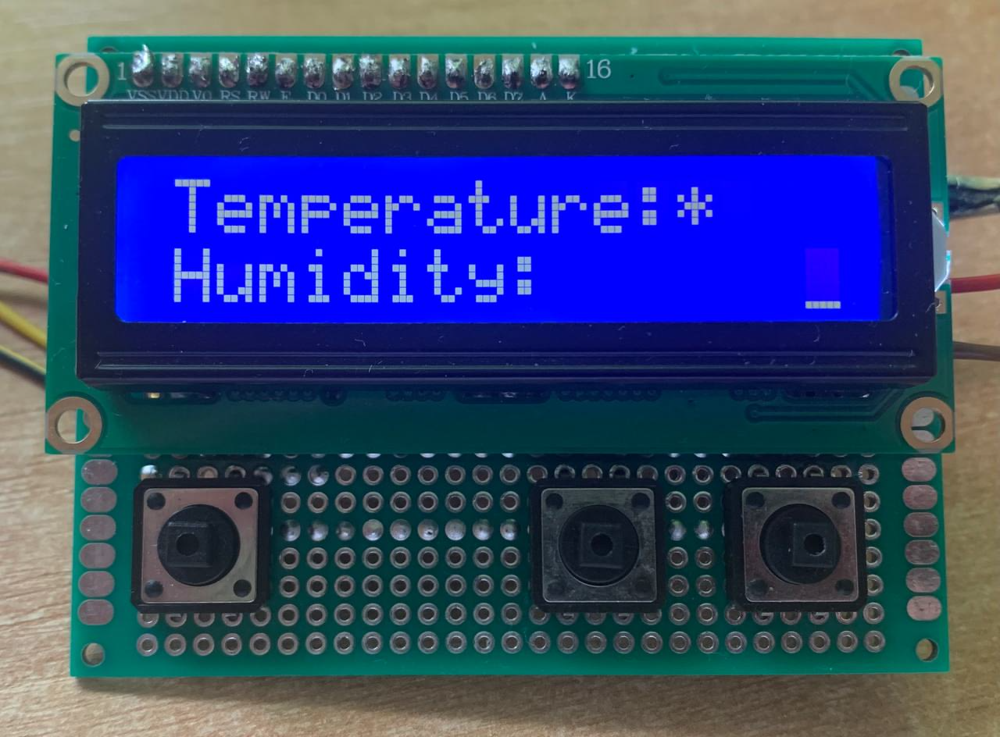
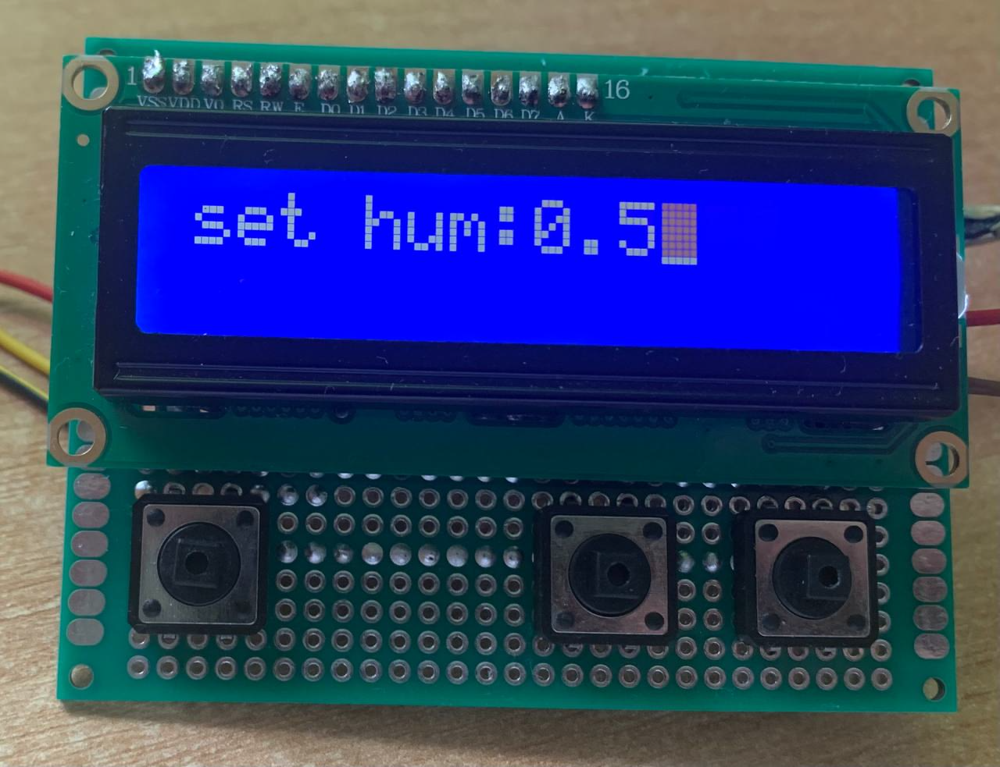
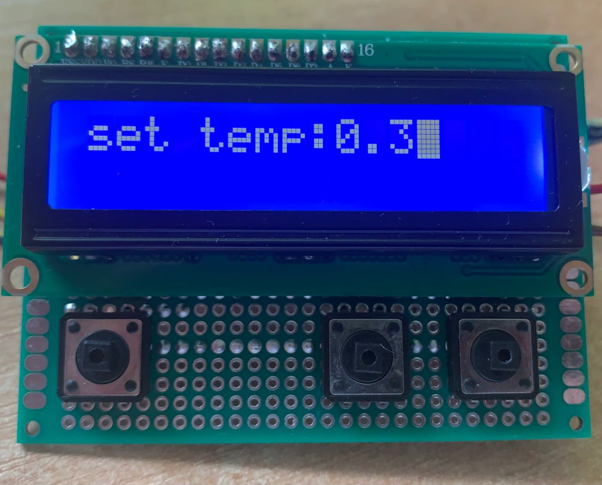

# ClimateControlStation

Проект системы климат-контроля на STM32F103C8 (Blue Pill).

##  Описание 
Устройство управляет температурой и влажностью: 
- Чтение данных с датчиков (DHT22).
- Управление реле и транзистором (обогрев, вентиляция).

Подключение компонентов к STM32

| Устройство         | Назначение              | Пин на STM32 | Порт | Описание                                      |
|--------------------|--------------------------|--------------|------|-----------------------------------------------|
| **LCD1602**        |                          |              |      | Подключение в 4-битном режиме                 |
| LCD RS             | Регистр/Данные           | PB9          | B    | Управляющий сигнал RS                         |
| LCD E              | Строб (Enable)           | PB7          | B    | Управляющий сигнал E                          |
| LCD D4             | Дата (бит 4)             | PA10         | A    | Старший бит 4-битной передачи данных          |
| LCD D5             | Дата (бит 5)             | PA11         | A    |                                                |
| LCD D6             | Дата (бит 6)             | PA12         | A    |                                                |
| LCD D7             | Дата (бит 7)             | PA15         | A    | Младший бит                                   |
| LCD RW             | Чтение/Запись            | GND          | —    | Всегда GND (только запись)                    |
| LCD VCC            | Питание                  | +5V          | —    |                                                |
| LCD GND            | Земля                    | GND          | —    |                                                |
| LCD Vo             | Контраст                 | через резистор или потенциометр, я устанавливал резистор на 3.36 кОм между пином и GND|

| **DHT22**          | Датчик температуры и влажности | PB8     | B    | Однопроводный интерфейс (с подтяжкой ~10 кОм к VCC) |

| Реле  | Управление вентилятором | PA5         | A    | Управляется через  релейный модуль  |
| Транзистор  | Управление нагревателем | PB14         | B    | Управляется через  транзистор  |

## Изображения проекта
 
Рис. 1: Главный экран системы

 

 
Рис. 2: Режим выбора настройки 

 
Рис. 3: Hастройка срабатывания реле в зависимости от влажности 

 
Рис. 4: Hастройка срабатывания транзистора в зависимости от температуры 

 
Рис. 5: Вид сзади

## Установка и запуск
1. Подключи STM32 через ST-Link.
2. Откройте проект в STM32CubeIDE или соберите и прошейте через `make flash` (если используешь Makefile).
3. Убедитесь, что питание на LCD = 5 В, Vo отрегулирован.
4. После запуска данные с DHT22 будут отображаться на LCD, и система будет управлять нагревом и вентиляцией после настройки на нужную температуру и влажность.

